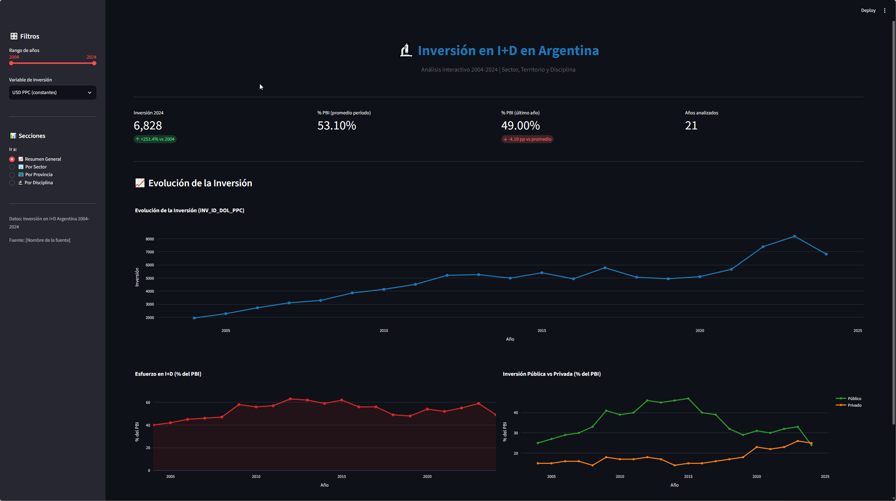
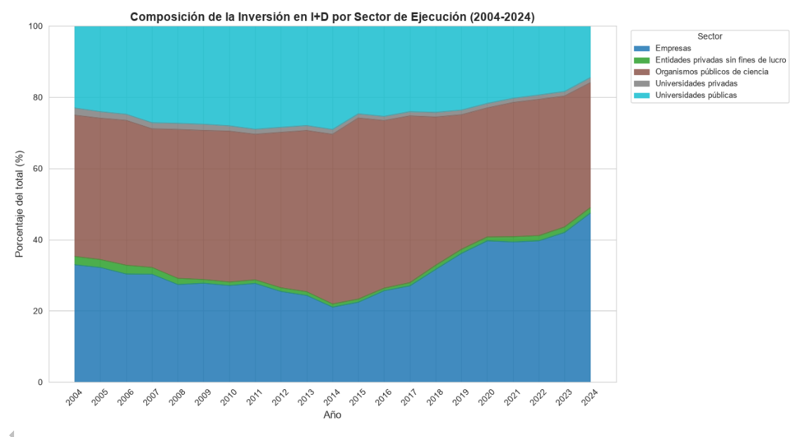
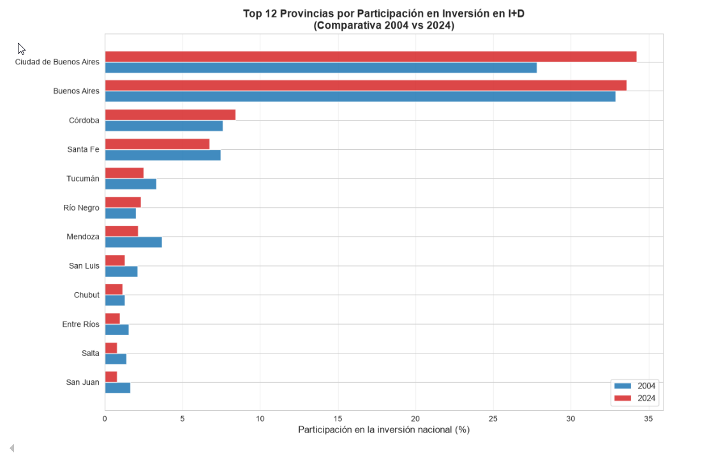
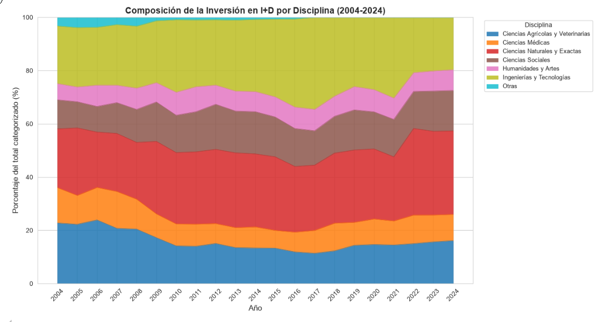

# 🔬 Análisis de la Inversión en I+D en Argentina (2004-2024)


Análisis exploratorio, estadístico y visual de la **inversión en Investigación y Desarrollo (I+D)** en Argentina durante el período **2004-2024**, desagregada por **sector de ejecución**, **jurisdicción** y **disciplina científica**.

**🚀 Dashboard interactivo en vivo:** [rd-investment-ar.streamlit.app](https://rd-investment-ar.streamlit.app)

---

## 📸 Vista previa del dashboard

| Resumen General | Por Sector |
|:-:|:-:|
|  |  |

| Por Provincia | Por Disciplina |
|:-:|:-:|
|  |  |

---

## 🎯 Hallazgos principales

### 1. 📉 Subinversión crónica
La inversión en I+D en Argentina **nunca superó el 0.65% del PBI** durante el período analizado. El promedio OCDE es de **~2.7%**. El pico histórico fue en **2012 (0.63%)** y el último dato (2024) muestra una caída al **0.49%**.

### 2. 🏛️ Dependencia estatal extrema
El **Estado (universidades públicas + organismos públicos de ciencia)** ejecuta aproximadamente el **70%** de la inversión total. El sector empresario, aunque creció del **15% al 26%** durante el período, sigue muy lejos de los estándares de países desarrollados (donde las empresas ejecutan 60-70%).

### 3. 🗺️ Concentración territorial creciente
**Ciudad de Buenos Aires + Provincia de Buenos Aires** concentran el **49% (2004) → 66% (2024)** del total nacional. La federalización de la ciencia **no ocurrió**: la concentración aumentó. Las 14 provincias del interior aportan menos del **10%** del total.

### 4. 🔬 Sesgo hacia disciplinas aplicadas
Las disciplinas que más crecieron fueron **Ciencias Médicas (+6 pp)**, **Ingenierías y Tecnologías (+6 pp)** y **Ciencias Agrícolas y Veterinarias (+5 pp)**. **Humanidades y Ciencias Sociales** se mantuvieron estables pero perdieron peso relativo.

### 5. 📉 Ciclicidad política y caída en 2024
La inversión en I+D es **cíclica** y depende de las decisiones políticas de cada gobierno. En **2024**, la inversión en USD PPC cayó un **17%** respecto a 2023, reflejando el ajuste fiscal.

---

## 📊 Análisis realizados

El proyecto incluye **5 análisis principales**, cada uno con su notebook o script correspondiente:

| # | Análisis | Ubicación |
|---|----------|-----------|
| 1 | **Evolución temporal** (USD PPC + % PBI) | `notebooks/analisis_inversion_id.ipynb` |
| 2 | **Composición por sector** (área apilada) | `notebooks/analisis_inversion_id.ipynb` |
| 3 | **Distribución territorial** (top provincias + heatmap) | `notebooks/analisis_inversion_id.ipynb` |
| 4 | **Evolución por disciplina** | `notebooks/analisis_inversion_id.ipynb` |
| 5 | **Análisis estadístico avanzado** (CAGR, correlaciones, Chi², ARIMA) | `notebooks/analisis_avanzados.ipynb` |

---

## 📁 Arquitectura del proyecto

```
R&D Investment DA/
│
├── data/                          # Datos fuente
│   └── inversion.xlsx            #    Dataset original (4 hojas)
│
├── docs/
│   └── screenshots/              # Capturas del dashboard para documentación
│       ├── 01_dashboard_resumen.png
│       ├── 02_dashboard_sector.png
│       ├── 03_dashboard_provincia.png
│       └── 04_dashboard_disciplina.png
│
├── notebooks/                     # Análisis exploratorio y estadístico
│   ├── analisis_inversion_id.ipynb
│   └── analisis_avanzados.ipynb
│
├── outputs/                       # Gráficos exportados por src/analisis.py
│   ├── 01_evolucion_temporal.png
│   ├── 02_composicion_sector.png
│   ├── 03_top_provincias.png
│   ├── 04_evolucion_disciplinas.png
│   └── 05_heatmap_provincias.png
│
├── src/                           # Módulos de código Python reutilizables
│   ├── etl.py                    #    Extracción, transformación y carga
│   ├── analisis.py               #    Análisis visual con matplotlib/seaborn
│   └── modelos.py                #    Modelos estadísticos (ARIMA, Gini, HHI, Shannon)
│
├── tests/                         # Suite de 53 tests unitarios
│   ├── conftest.py               #    Fixtures compartidas
│   ├── test_datos.py             #    Tests de carga y calidad de datos
│   ├── test_analisis.py          #    Tests de funciones de análisis
│   ├── test_utils.py             #    Tests de utilidades
│   └── test_modelos.py           #    Tests de modelos estadísticos
│
├── .streamlit/
│   └── config.toml               # Configuración de tema del dashboard
│
├── .gitignore                     # Exclusión de archivos innecesarios
├── app.py                         # Dashboard interactivo (Streamlit)
├── CITATION.cff                   # Formato de citación académica
├── LICENSE                        # Licencia MIT
├── pytest.ini                     # Configuración de testing
├── README.md                      # Este archivo
└── requirements.txt               # Dependencias del proyecto
```

---

## ⚙️ Instalación y uso

### Requisitos previos

- **Python 3.10+**
- **pip** actualizado
- **Git** (para clonar el repo)

### 1. Clonar el repositorio

```bash
git clone https://github.com/[TU-USUARIO]/rd-investment-ar.git
cd rd-investment-ar
```

### 2. Crear entorno virtual

```bash
# Windows
python -m venv .venv
.venv\Scripts\Activate.ps1

# macOS / Linux
python3 -m venv .venv
source .venv/bin/activate
```

### 3. Instalar dependencias

```bash
pip install -r requirements.txt
```

### 4. Ejecutar el dashboard

```bash
streamlit run app.py
```

Se abre automáticamente en `http://localhost:8501`.

### 5. Ejecutar los notebooks

```bash
jupyter notebook notebooks/
```

### 6. Regenerar los gráficos estáticos

```bash
python src/analisis.py
```

Los gráficos se guardan en `outputs/`.

---

## 🧪 Tests

El proyecto incluye **53 tests unitarios** con `pytest` que validan:

- ✅ Carga correcta de las 4 hojas del Excel
- ✅ Calidad de datos (sin nulos, valores positivos, rangos válidos)
- ✅ Consistencia entre hojas (Sector y Provincias suman al total nacional)
- ✅ Función de CAGR (casos normales y bordes)
- ✅ Modelos estadísticos: ARIMA, Gini, Herfindahl, Shannon, regresión, correlación

### Ejecutar todos los tests

```bash
pytest
```

### Ejecutar con cobertura

```bash
pytest --cov=src --cov-report=html
```

**Estado actual:** `53 passed in 38s` ✅

---

## 📚 Stack tecnológico

| Categoría | Herramientas |
|-----------|-------------|
| **Manipulación de datos** | pandas, numpy, openpyxl |
| **Visualización** | matplotlib, seaborn, plotly |
| **Dashboard** | Streamlit |
| **Estadística y modelado** | scipy, statsmodels (ARIMA) |
| **Notebooks** | Jupyter |
| **Testing** | pytest, pytest-cov |
| **Control de versiones** | Git, GitHub |

---

## 📈 Metodología

### Fuente de datos

El dataset contiene 4 hojas con información desagregada:

- **Recursos Financieros:** serie temporal 2004-2024 con totales nacionales en múltiples monedas (pesos corrientes, pesos constantes, dólares corrientes, dólares PPC).
- **Sector:** desagregación por sector de ejecución (universidades, organismos públicos, empresas, etc.).
- **Provincias:** desagregación por las 24 jurisdicciones (23 provincias + CABA).
- **Disciplinas:** desagregación por disciplina científica.

### Tratamiento de la inflación

⚠️ **Punto crítico:** Los valores en **pesos corrientes** están fuertemente distorsionados por la inflación argentina (~40% anual promedio en el período). Para análisis de series largas se usa:

- **USD PPC (Paridad de Poder Adquisitivo):** medida en dólares constantes, adecuada para comparaciones temporales.
- **% del PBI:** medida de esfuerzo relativo, elimina el efecto de la inflación.

### Análisis estadísticos aplicados

- **CAGR** (Compound Annual Growth Rate) por sector y provincia.
- **Correlación de Pearson** entre variables de inversión.
- **Test Chi-cuadrado** de homogeneidad para validar cambio estructural en la composición sectorial.
- **Test t de Student** para comparar medias entre períodos.
- **Modelo ARIMA(1,1,1)** para proyección de la inversión 2025-2027.
- **Índices de concentración:** Gini, Herfindahl-Hirschman (HHI) y Shannon.

---

## ⚠️ Limitaciones metodológicas

1. **Hoja de Disciplinas incompleta:** La suma de las disciplinas **NO coincide** con el total nacional. La brecha crece año a año (248 en 2004 → +7.000 en 2023). Los porcentajes por disciplina son sobre el **subconjunto categorizado**, no sobre el total.
2. **Pesos corrientes:** CAGRs calculados en pesos corrientes incluyen inflación. Un CAGR de 40% no implica crecimiento real.
3. **Categoría "Otras" desapareció en 2017:** Cambio metodológico que dificulta comparaciones pre/post 2017.
4. **Muestra corta para ARIMA:** Con solo 21 puntos, el modelo no convergió óptimamente. Las proyecciones son un **escenario base**, no una predicción certera.
5. **Correlación ≠ causalidad:** La correlación negativa entre inversión pública y privada (-0.55) sugiere sustitución, pero no podemos probar causalidad con este dataset.
6. **Datos hasta 2024:** El impacto completo del ajuste fiscal de 2024 puede reflejarse en 2025.

---

## 🚀 Demo en vivo

El dashboard está deployado en **Streamlit Cloud** y es de acceso público:

**🔗 [rd-investment-ar.streamlit.app](https://rd-investment-ar.streamlit.app)**

Incluye:
- Filtros por rango de años y variable monetaria
- 4 secciones navegables (Resumen, Sector, Provincia, Disciplina)
- Gráficos interactivos con Plotly (zoom, hover, leyendas clickeables)

---

## 👤 Autor

**[Tu Nombre Completo]**

- 📧 Email: [tu-email@ejemplo.com]
- 💼 LinkedIn: [linkedin.com/in/tu-perfil](https://linkedin.com/in/tu-perfil)
- 🐙 GitHub: [@TU-USUARIO](https://github.com/TU-USUARIO)

---

## 🙏 Agradecimientos

- Fuente de datos: [Nombre de la institución]
- Inspirado en las mejores prácticas de análisis de datos abiertos

---

## 📄 Licencia

Este proyecto está bajo la licencia **MIT**. Ver el archivo [LICENSE](LICENSE) para más detalles.

---

## ⭐ ¿Te gustó el proyecto?

Si te resultó útil, ¡dejale una estrella al repo! ⭐